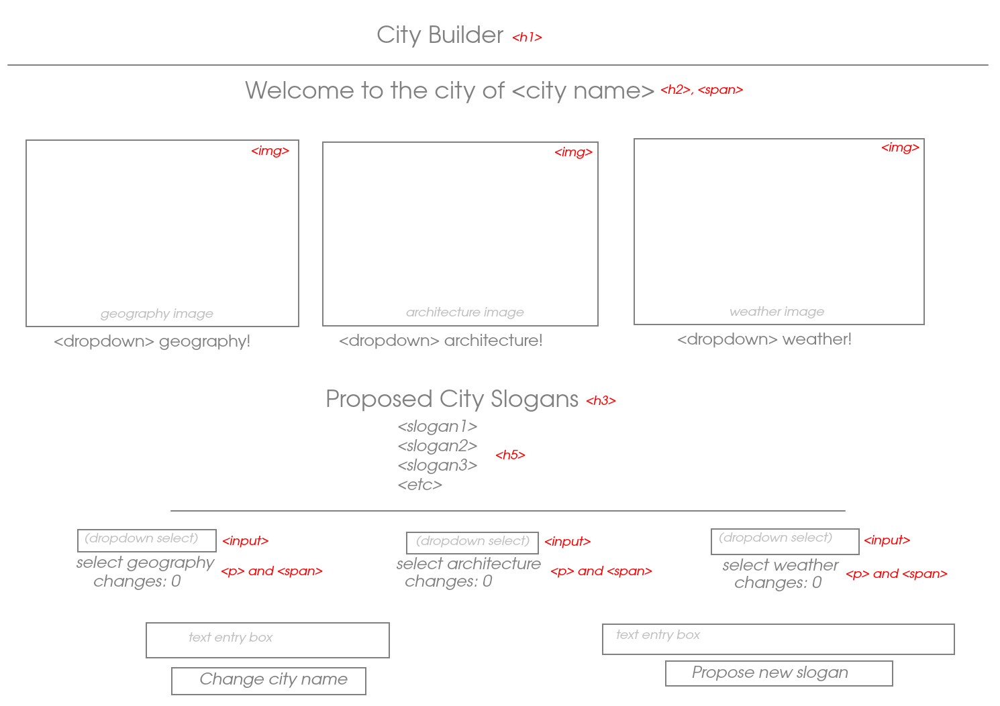

# City Builder

Makes a sort of city splash poster. You can customize the images used, as well as the potential slogans and name.

## Wireframe

## States

- Counters for image changes (all three)
- City name
- City slogans

## Events

- Add new slogan: add to list of displayed slogans
- Any dropdown menu change: change corresponding image
- Change city name: update displayed name

## Functions

- `displayStats()`: updates counters for image changes
- `displaySlogans()`: renders contents of slogan array to page
